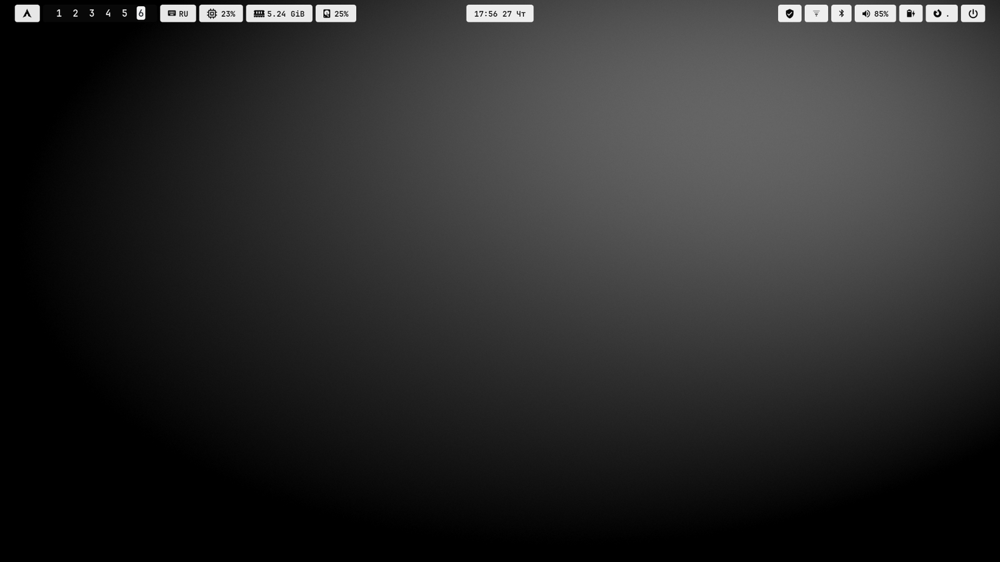

# hyprland-dotfiles

*[Русская версия](README.ru.md)*


A monochrome Hyprland desktop, installed in whole or in part. Take the lot, or
take only the status bar — the installer asks which modules you want, backs up
whatever it replaces, and `uninstall.sh` puts your own files back.



Nothing here is colour-themed: the palette is black, greys and white, and state
is carried by brightness rather than hue. The wallpaper is one of four
generated procedurally by [hypr-lock-theme](https://github.com/Whyslab/hypr-lock-theme).

## Modules

```bash
./install.sh --list
```

| Module | What it installs |
|---|---|
| `core` | `hyprland.conf` — keybindings, window rules, the palette |
| `panel` | HyprPanel, with CPU/RAM/disk modules that report what is actually heavy |
| `terminal` | kitty and btop, matching the palette |
| `menus` | the rofi theme and the wlogout power menu |
| `scripts` | screenshots, wallpaper switching, the btop scratchpad |
| `fonts` | fontconfig rules: colour emoji ahead of icon fonts, correct Han glyphs |
| `housekeeping` | a weekly timer that clears regenerable caches |
| `wallpapers` | an empty wallpaper directory and a wallhaven fetcher |


## Installation

```bash
git clone https://github.com/Whyslab/hyprland-dotfiles.git
cd hyprland-dotfiles
./install.sh
```

It asks which modules you want. Non-interactively:

```bash
./install.sh --all
./install.sh --modules panel,terminal,menus
./install.sh --dry-run                    # print every step, change nothing
./install.sh --prefix /tmp/test           # install into a throwaway directory
```

**Nothing is overwritten without a copy.** Every file the installer replaces is
saved under `~/.local/share/hyprland-dotfiles/backup-<date>/`, and the list of
what was installed goes to `installed.txt` beside it. That is what makes
`uninstall.sh` able to put your own config back exactly as it was.

No root at any point, and no package is installed for you: the installer reports
what is missing and copies the configs anyway, so you can install the parts you
actually want later.

### What the modules expect

| Module | Wants |
|---|---|
| `core` | `hyprland` |
| `panel` | `hyprpanel` |
| `terminal` | `kitty`, `btop` |
| `menus` | `rofi`, `wlogout` |
| `scripts` | `grim`, `slurp`, plus `hyprpicker` and `awww` for the frozen-screen capture and the wallpaper daemon |

A Nerd Font is assumed throughout — the configs ask for JetBrainsMono Nerd Font.

### The companion repositories

`hyprland.conf` binds keys to four tools that live in their own repositories,
because each is useful without the rest of this desktop:

| Key | Tool |
|---|---|
| `SUPER + R` | [rofi-launcher](https://github.com/Whyslab/rofi-launcher) — applications, with folders and pinned entries |
| `SUPER + SHIFT + C` | [rofi-command-center](https://github.com/Whyslab/rofi-command-center) — 200 system commands |
| `SUPER + SHIFT + B` | [backup-manager](https://github.com/Whyslab/backup-manager) — encrypted nightly backups |
| `SUPER + SHIFT + N` | [screen-sleep](https://github.com/Whyslab/screen-sleep) — idle, sleep and the night filter |
| lock screen | [hypr-lock-theme](https://github.com/Whyslab/hypr-lock-theme) — hyprlock and hypridle |

Those keys do nothing until the tool is installed. Clone the ones you want:

```bash
./install.sh --companions rofi-launcher,screen-sleep
```

Each is cloned to `~/Projects/` and installs itself with its own `install.sh` —
this repository never installs another one for you.

## Keys

| Key | Action |
|---|---|
| `SUPER + Q` | terminal |
| `SUPER + C` | close the window |
| `SUPER + E` | file manager |
| `SUPER + F` | browser |
| `SUPER + V` | toggle floating |
| `SUPER + 1…0` | switch workspace |
| `SUPER + SHIFT + 1…0` | move the window to a workspace |
| `SUPER + PgUp/PgDn` | previous / next workspace |
| `ALT + Tab` | cycle windows on this workspace |
| `SUPER + LMB / RMB` | move / resize a window |
| `SUPER + SHIFT + S` | screenshot a region |
| `Print` | screenshot the whole screen |
| `SUPER + W` | next wallpaper |
| `SUPER + SHIFT + W` | pick a wallpaper |
| `SUPER + \`` | btop, over whatever is focused |
| `CTRL + J` | clipboard history |
| `CTRL + D` | colour picker |
| `SUPER + Esc` | the power menu |

Three-finger horizontal swipe switches workspaces.

## The parts worth explaining

### The panel modules report what is heavy *now*

HyprPanel's built-in CPU module gives a percentage. These replacements add the
five processes actually using the CPU, computed from the **delta** between
polls the way btop does it — not from `ps %cpu`, which averages over a
process's whole lifetime and so keeps a daemon that was busy at startup pinned
at the top for hours.

```json
{"pct":"28","cores":"4","top":"  9.9%  firefox  690\n  5.9%  Isolated Web Co  158696"}
```

The disk module breaks down the number the bar shows, because it does not match
`df`:

```
used    = total - available   ← where the percentage comes from
data    = actually occupied by files
reserve = the 5% ext4 keeps for root, used - data
```

Each module prints one line of JSON and nothing else, which is what makes them
usable from Waybar or any other bar that can run a command.

### Screenshots that do not kill tooltips

`grim -g "$(slurp)"` runs slurp first, and slurp covers the screen with its own
layer-shell surface. Hyprland sends `wl_pointer.leave` to the panel, GTK hides
the tooltip, and grim captures a bar with nothing on it.

`screenshot.sh` reverses the order: capture the pixels first, freeze that image
with hyprpicker, then select a region and crop it out of the capture. The
tooltip is in the shot because it was still on screen when the shot was taken.

### btop lives in a special workspace

btop starts with the session, hidden. By the first time you press `SUPER + \``
its graphs already hold history instead of starting from an empty axis. Esc
hides the window rather than closing it, so that stays true for the next time.

The binding is `code:49` — the physical key below Esc — rather than a character,
so it works the same in every keyboard layout.

### Three wallpapers, not one

`wallpaper.sh` drives three independent backgrounds: the desktop through `awww`,
the lock screen through a symlink hyprlock reads, and the SDDM login screen
through `/var/lib/sddm-wallpaper/current.jpg` (downscaled and re-encoded, so a
4K original does not cost the greeter anything). `SUPER + SHIFT + W` asks which
of the three you mean.

## Wallpapers

The directory ships empty. The images used on the machine this came from were
mostly downloaded from wallhaven and are not ours to redistribute, and 85 MB of
JPEGs in a config repository serves nobody.

Four monochrome 4K wallpapers are generated procedurally by hypr-lock-theme, or
list wallhaven ids and fetch them:

```bash
cp wallpapers.list.example wallpapers.list
$EDITOR wallpapers.list
./fetch-wallhaven.sh
```

The URL is derived from the id, so no API key and no account are needed. See
[wallpapers/README.md](wallpapers/README.md).

## Limitations

- **One monitor, one scale.** `screenshot.sh` converts between logical and
  physical coordinates assuming a single scale factor; with mixed-DPI monitors
  the crop lands in the wrong place.
- **Arch-shaped.** Nothing here is Arch-only, but package names in the
  documentation are, and `clean-caches.sh` clears caches for the tools this
  machine happens to use.
- **hyprland.conf is one file, not a set of includes.** Taking a piece of it
  means editing it, not omitting an include.
- **The panel is HyprPanel.** The CPU/RAM/disk scripts work with any bar that
  runs a command, but `config.json` and `modules.json` do not.
- **No display manager config.** SDDM only enters through the wallpaper path;
  the theme itself is not part of this.

## Uninstall

```bash
./uninstall.sh                # remove the installed files, restore your originals
./uninstall.sh --keep-backups # remove them, leave the backups alone
```

It works from `installed.txt`, so it removes exactly what was installed and
nothing else. Your wallpapers, and any companion repositories cloned into
`~/Projects/`, are left alone.

## Development

```bash
bash tests/run-tests.sh
```

51 checks, none of which need a Hyprland session, a display or root: shell
syntax, that every shipped JSON and the fontconfig XML parse, that a module
installs its own files and nobody else's, that no `__HOME__` placeholder
survives into an installed file, that uninstall restores replaced originals
while leaving user wallpapers alone, that each panel module emits one line of
valid JSON containing every key the bar substitutes, and that none of it breaks
under a comma-decimal locale.

## License

MIT — see [LICENSE](LICENSE).
